# Watershed Algorithm 
Watershed is area where all water fall and snow melt are diverted down to streams, rivers and eventually to reservoirs, bays, and ocean.                    
Any grayscale image can be viewed as tropographical surface where high intensity denotes peaks and hills while low intensity denotes valleys. 


For human eyes the coins placed to each other might look separated but in computer vision use some kind of filtering it will see all the coins are connected with eath other. 


Physically they are separate coins but some computer vision algorithm we can see they are block of same image with white background.


Segment the image with 8 for the coins and 1 for the background.

```Python
import cv2
import numpy as np
import matplotlib.pyplot as plt

def display(image, cmap = 'gray'):
    fig = plt.figure(figsize = (12, 10))
    ax = fig.add_subplot(111)
    ax.imshow(image, cmap = 'gray')

coins = cv2.imread('coins.jpg')
display(coins)

# apply median blue, not concerned about drawing inside but
# concern with the circle of the coin only, convert to grayscale
# apply binary threshold
# find the contour. 
sep_blur = cv2.medianBlur(coins,21)
display(sep_blur)
```
Output:                             
      
       

```Python
# converting to gray scale image
gray_sep_coins = cv2.cvtColor(sep_blur, cv2.COLOR_BGR2GRAY)
display(gray_sep_coins)
```
Output:                                     


```Python
# apply binary threshold for separating foreground and background
ret, sep_threshold = cv2.threshold(gray_sep_coins, 250, 255, cv2.THRESH_BINARY_INV)
display(sep_threshold)
```
Output:                                         


```Python
# Assuming sep_threshold is your binary image
contours, hierarchy = cv2.findContours(sep_threshold.copy(), cv2.RETR_CCOMP, cv2.CHAIN_APPROX_SIMPLE)

for i in range(len(contours)):
    if hierarchy[0][i][2] == -1:  # external contour
        cv2.drawContours(coins, contours, i, (255, 0, 0), 10)

# Display the image with contours
display(coins)

```
The output of the image shows giant connected image at some points, need advance algorithm for separating.
Output:                             


```Python
image = cv2.imread('coins.jpg')

# apply large kernel size if the image size is big
image = cv2.medianBlur(image, 25)
display(image)
```
Output:                                         


```Python
# converting to gray scaleC
gray_image = cv2.cvtColor(image, cv2.COLOR_BGR2GRAY)
display(gray_image)
```
Output:                                                

```Python
# applying threshold
ret, thresh = cv2.threshold(gray_image, 250, 255, cv2.THRESH_BINARY_INV)
display(thresh)
```
We can find some noise in the image where inside of white coin there are few black spot; we will try Otsu's method which works well with watershed algorithm.
Output:                             


```Python
# applying threshold
ret, thresh = cv2.threshold(gray_image, 0, 255, cv2.THRESH_BINARY_INV + cv2.THRESH_OTSU)
# Noise removal
kernel = np.ones((3, 3), np.uint8)

opening = cv2.morphologyEx(thresh, cv2.MORPH_OPEN, kernel, iterations=2)
display(opening)
```
Output:                                 


We can use distance transformation where the image at the center are brighter and image distance away from center appears lighter and lighter.

So we apply distance transformation on the thresh imae where it will appear brighter in the center and darker moving away from center since the coins are joined.
```Python
dist_transform = cv2.distanceTransform(thresh, cv2.DIST_L2, 5)

display(dist_transform)
```
Output:                                     


```Python
# will apply another thresholding
ret, sur_fg = cv2.threshold(dist_transform, 0.7 * dist_transform.max(), 255, 0)
display(sur_fg)
```
Output:                         


```Python
# display and find unknown regions
sur_fg = np.uint8(sur_fg)

unknown = cv2.subtract(sur_bg, sur_fg)
display(unknown)
```
Output:                                 


Creating level marker
```Python
# creating level marker
ret, marker = cv2.connectedComponents(sur_fg)
marker
```
Output:                             
```Python
array([[0, 0, 0, ..., 0, 0, 0],
       [0, 0, 0, ..., 0, 0, 0],
       [0, 0, 0, ..., 0, 0, 0],
       ...,
       [0, 0, 0, ..., 0, 0, 0],
       [0, 0, 0, ..., 0, 0, 0],
       [0, 0, 0, ..., 0, 0, 0]], dtype=int32)
```
```Python
# creating level marker
ret, marker = cv2.connectedComponents(sur_fg)
marker = marker + 1 # done to distinguish marker from background

marker[unknown == 255] = 0
display(marker)
```
Output:                                 


```Python
# apply watershed algorithm
marker = cv2.watershed(image, marker)
display(marker)
```
From the given output we can find different coin size with differe colored 
Output                                          


```Python
# Assuming sep_threshold is your binary image
contours, hierarchy = cv2.findContours(marker.copy(), cv2.RETR_CCOMP, cv2.CHAIN_APPROX_SIMPLE)

for i in range(len(contours)):
    if hierarchy[0][i][2] == -1:  # external contour
        cv2.drawContours(coins, contours, i, (255, 0, 0), 10)

# Display the image with contours
display(coins)
```
We some how able to separate the each individual coin from each other

Output:                                             


## Customer Seeds with Watershed Algorithm
Automatically the different area are segmented whith mouse click.
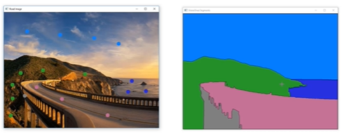

```Python
import cv2
import numpy as np
import matplotlib.pyplot as plt

road = cv2.imread('road.jpg')
road_copy = np.copy(road)

plt.imshow(road_copy)
```
Ouput:                          
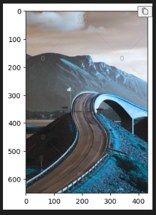

```Python
# create empty space for result to be drawn
road_copy.shape
```
Output:                             
```Python
(650, 433, 3)
```
```Python
# create empty space for result to be drawn
# not required color channel so we use :2 for extracting
# height and weidth
road_copy.shape[:2]
```
Output:                             
```Python
(650, 433)
```

```Python
marker_image = np.zeros(road.shape[:2], dtype=np.int32)

# segment
segments = np.zeros(road.shape, dtype=np.uint8)

marker_image.shape
segments.shape
```
Output:                                     
```Python
(650, 433)
(650, 433, 3)
```

```Python
from matplotlib import cm

cm.tab10(0)
```
Result is RGB color with alpha parameter ranges from 0 and 1
Output:                                     
```Python
(0.12156862745098039, 0.4666666666666667, 0.7058823529411765, 1.0)
```
```Python
# converting to to 0 to 255
tuple(np.array(cm.tab10(0)[:3])*255)
```
Output:                                         
```Python
(31.0, 119.0, 180.0)
```
```Python
def create_rgb(i):
    return tuple(np.array(cm.tab10(i)[:3])*255)

colors = []
for i in range(10):
  colors.append(create_rgb(i))

colors = []
for i in range(10):
  colors.append(create_rgb(i))
```
Output:                                                     
```Python
[(31.0, 119.0, 180.0),
 (255.0, 127.0, 14.0),
 (44.0, 160.0, 44.0),
 (214.0, 39.0, 40.0),
 (148.0, 103.0, 189.0),
 (140.0, 86.0, 75.0),
 (227.0, 119.0, 194.0),
 (127.0, 127.0, 127.0),
 (188.0, 189.0, 34.0),
 (23.0, 190.0, 207.0)]
```
```Python
# set up callback function
# global variables
# call back function
# while true
n_markers = 10 # 0 to 9
current_marker = 1 # index position
mark_updates = False # checks markers has been updated

def mouse_callback(event, x, y, flags, param):
    global mark_updates

    if event == cv2.EVENT_LBUTTONDOWN:
        # draw 2 circles one for watershed and one for human visulization
        # marker passed to watershed algorithm
        cv2.circle(marker_image, (x, y), 10, (current_marker), -1)


        # user sees
        cv2.circle(road_copy, (x, y), 10, colors[current_marker], -1)
        mark_updates = True

cv2.namedWindow('Road Image')
cv2.setMouseCallback('Road Image', mouse_callback)

while True:
    cv2.imshow('Watershed Segments', segments)
    cv2.imshow('Road Image',road_copy)  

    #close all windows, upade color choice, update the marking
    k = cv2.waitKey(1)
    if k == 27:
        break
    # clearning all the colors press c key
    # resets images 
    elif k == ord('c'):
        road_copy = road.copy()
        marker_image = np.zeros(road.shape[:2], dtype=np.int32)
        segments = np.zeros(road.shape, dtype=np.uint8)
    # update color choice
    elif k > 0 and chr(k).isdigit():
        current_marker = int(chr(k))

    if mark_updates:
        marker_image_copy = marker_image.copy()
        cv2.watershed(road, marker_image_copy)

        segments = np.zeros(road.shape, dtype=np.uint8)
        for color_index in range(n_markers):
            # coloring segments using numpy call
            segments[marker_image_copy == (color_index)] = colors[color_index]

cv2.destroyAllWindows()
```
Output:                                         


# Face Detection 
Face detection using Haar Cascades --- key components of the Viola-Jones object detection framewor, concept of face detection analyzing a few key features.                     
Main Features Types
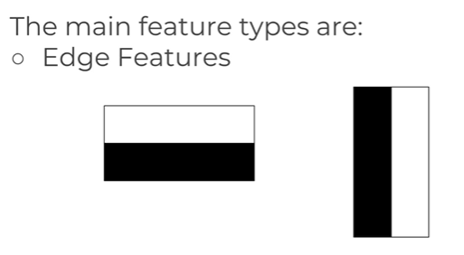
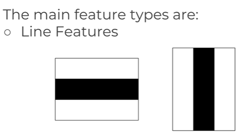

Then we take average of the dark and lighter regions
```Python
Mean = 6.5/8 = 0.8125
Mean = 1.2/8 = 0.15
```
Over all delat 
```Python
delta = 0.8125 - 0.15 = 0.6625
```
Closer we are to 1 better the actual features, decide threshold and throw away this features and say something like above 0.5 there is edge. Computing sums for the entire image would be computationally expensive, have to check every single possibiluty of every features.
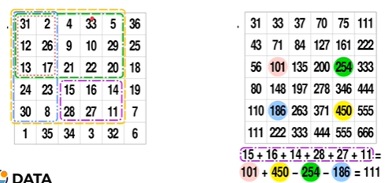
In this image what its done is 31 is kept as it is, added 2 to 31 which is equal to 33, next have added 4 to make it 37 and so on helping quickly calculate the sum.
Next whit it does is considering the different rectangles marked we take the right bottom corner value as reference of the value of the top left corner and this will helpt to compute very fast. 

First need image that is looking at camera, convert the image to grayscale since we are only interested at intensity of light vs dark. Search for Haar Cascade Features. Will start first feature like eyes and cheek where eyes are more darker than cheek regions.
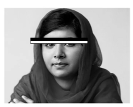
if it does not pass that means we dont have face and search for other thousand of features.
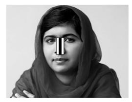
next we find another feature, bridge of the nose and keep going and going untill you we pass majority of the features.
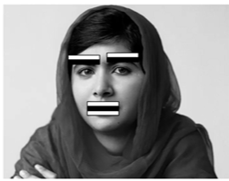
The go fro detecting eyesbrows, mouth and so on until algorithm decides it has detected face.
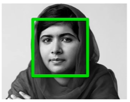

# Face Detection with Python Code
```Python
import cv2
import numpy as np
import matplotlib.pyplot as plt

danis = cv2.imread('denis.jpeg', 0)

nadia = cv2.imread('nadia.jpeg', 0)

solvay = cv2.imread('Solvay_conference_1927.jpg', 0)

plt.imshow(nadia)
plt.imshow(danis)
plt.imshow(solvay)
```
Output:                 
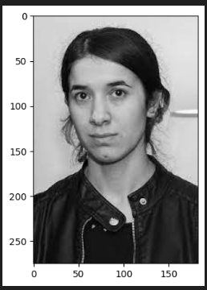
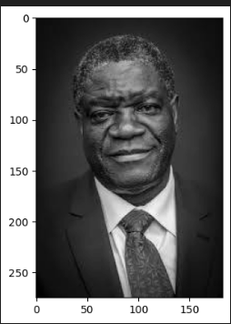
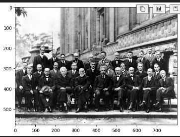
create classifier and pass xml classifier

```Python
face_cascad = cv2.CascadeClassifier('https://github.com/kipr/opencv/blob/master/data/haarcascades/haarcascade_frontalface_default.xml')

def detect_fac(img):
    fac_img = img.copy()

    fac_rect = face_cascad.detectMultiScale(fac_img)
    for (x, y, w, h) in fac_rect:
        cv2.rectangle(fac_img, (x, y), (x+w, y+h), (255, 255, 255), 10)
    return fac_img

result = detect_fac(danis)
plt.imshow(result, cmap='gray')

result = detect_face(nadia)
plt.imshow(result, cmap = 'gray')

result = detect_face(solvay)
plt.imshow(result, cmap = 'gray')
```
Output:                         
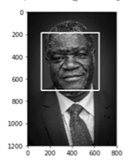
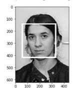
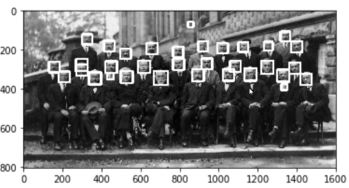

```Python
def adj_detect_fac(img):
    fac_img = img.copy()

    fac_rect = face_cascad.detectMultiScale(fac_img, scaleFactor=1.2, minNeighbors=5)
    for (x, y, w, h) in fac_rect:
        cv2.rectangle(fac_img, (x, y), (x+w, y+h), (255, 255, 255), 10)
    return fac_img

result = adj_detect_face(solvay)
plt.imshow(result, cmap = 'gray')
```
The extrace face detection or face that are turned off from camera is not detected.
Output:                                     
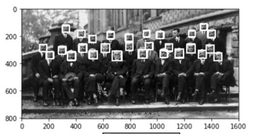

```Python
eye_cascade = cv2.CascadeClassifier('https://github.com/kipr/opencv/blob/master/data/haarcascades/haarcascade_eye.xml')

def detect_eyes(img):
    fac_img = img.copy()

    eye_rect = eye_cascade.detectMultiScale(fac_img)
    for (x, y, w, h) in eye_rect:
        cv2.rectangle(fac_img, (x, y), (x+w, y+h), (255, 255, 255), 10)
    return fac_img

result = detect_eyes(nadia)
plt.imshow(result, cmap='gray')
```
Detected eyes but also detect nostrial so have to adjust scalFactor and minNeighbour
Output:       
     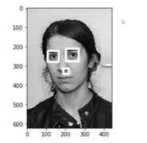                                 

```Python
def detect_eyes(img):
    fac_img = img.copy()

    eye_rect = eye_cascade.detectMultiScale(fac_img, scaleFactor=1.2, minNeighbors=5)
    for (x, y, w, h) in eye_rect:
        cv2.rectangle(fac_img, (x, y), (x+w, y+h), (255, 255, 255), 10)
    return fac_img
```
Output:                                     
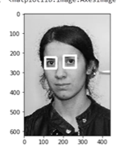

Image of the denis will not work since his eyes are all dark so cant capture 

How we can capture using videos
```Python
cap = cv2.VideoCapture(0)

while True:
    ret, frame = cap.read()
    
    frame = detect_fac(frame)

    cv2.imshow("Video Face Detect", frame)

    c = cv2.waitKey(1)
    if k == 27:
        break

cap.release()
cv2.destroyAllWindows()
```
Output:                                     
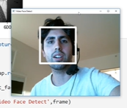