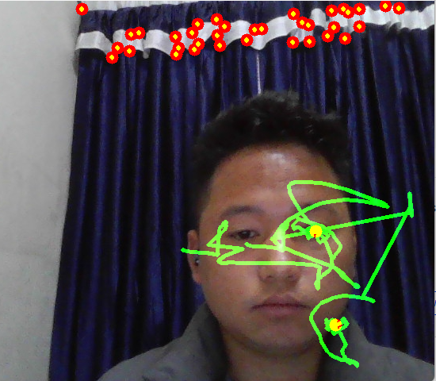
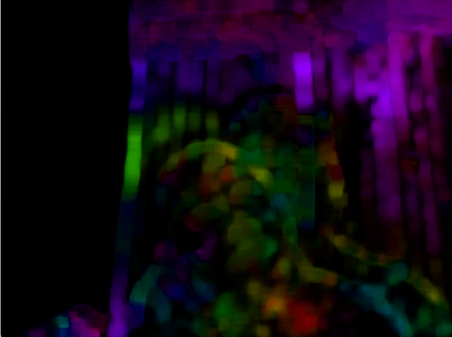
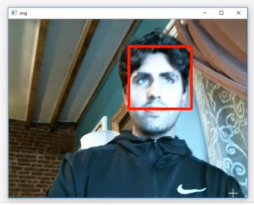
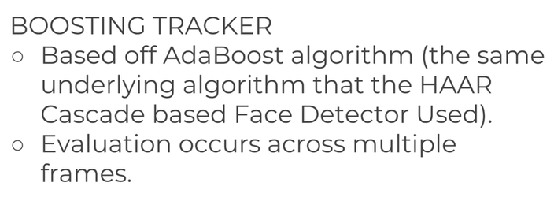
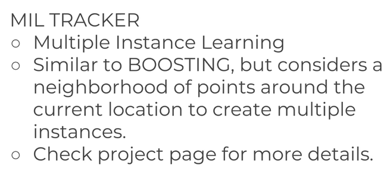
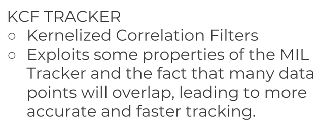
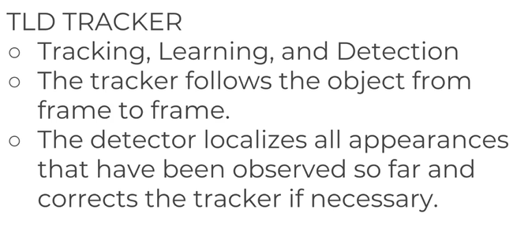
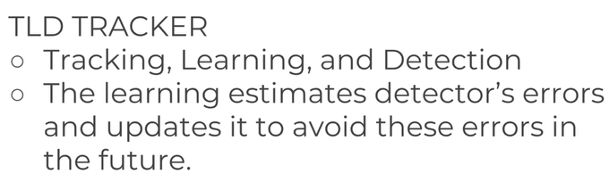
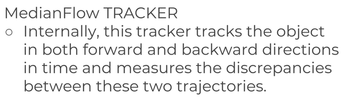

# Section 7 Object Tracking
Learn about object tracking techniques such as Optical Flow, MeanShift and CamShift

Analogy:Keeping eyes on specific person in crowd where he/she is moving.First computer is shown the object by drawing box around it, where computer uses information to track the object goes in the video frame by frame. Each frame of the video is analysed by computer and find similarities between the object shown and what its sees. 

## Optical Flow
Imagine you're sitting by a river, and you drop some leaves onto the water's surface. As the leaves float downstream, you can see how the water moves them. Optical flow is like that, but for pixels in a video.

Here's how it works: Every pixel in a video has a "neighborhood" of pixels around it. Optical flow analyzes how these pixels move from one frame of the video to the next. It's like watching how the river current affects each leaf as it moves downstream.

Just as you might notice that some leaves move faster or slower depending on where they are in the river, optical flow can detect how fast each pixel is moving and in what direction. This information helps us understand the motion happening in the video.

For example, if you're tracking a car in a video, optical flow can help determine how fast the car is moving and which way it's going, by analyzing how the pixels representing the car move from frame to frame.

Opticla flow estimates motion objects between first frame in the video to next freame of the video. There are two methods:   
                                               1.  Dense Optical Flow - every pixel tracked using Gunnar Farneback                                             
2. Sparse Optical Flow - features tracked using Lucas-Kanade                                            

Application:                                        
Motion Anlaysis                     
Object Tracking                 
Gesture recognization                   
Navigation                                             
The optical flow methods first given set of points and frame and will attempt to find those points in the next frame.

## Optical Flow Coding with OpenCV
### Lucas Kanade method


```Python
import cv2 
import numpy as np

# set some parameter values using Shi-Tomasi Corner Detection
corner_track_params = dict(maxCorners = 10, qualityLevel = 0.3, minDistance = 7, blockSize =7)

# smaller window size are more prone to noise, larger windown
# size may not be sensetive to smaller motions of the points, points
# may be moving but it feels the frame is not moving
# maxLevel creates image pyramid with different resolution
# next we use pip operator providing two criteria to perform Lucas-Kanade optical Flow
# provide max iterations and provide epsilon which is 0.03. More iteration
# means more exhaustive serach of points, smaller eps means gonna finish earlier
# esp exchange speed of your tracking vs accuracy of your tracking
lk_params = dict(winSize = (200, 200), maxLevel = 2, criteria = (cv2.TERM_CRITERIA_EPS | cv2.TERM_CRITERIA_COUNT, 10, 0.03))
```
```Python
# Initialize the video capture
cap = cv2.VideoCapture(0)

# Read the very first frame
ret, prev_frame = cap.read()

# Convert the first frame to grayscale
prev_gray = cv2.cvtColor(prev_frame, cv2.COLOR_BGR2GRAY)

# Points to track using good feature tracking
prevPts = cv2.goodFeaturesToTrack(prev_gray, mask=None, maxCorners=100, qualityLevel=0.3, minDistance=7, blockSize=7)

# Create an empty mask
mask = np.zeros_like(prev_frame)

# Parameters for Lucas-Kanade optical flow
lk_params = dict(winSize=(15, 15), maxLevel=2, criteria=(cv2.TERM_CRITERIA_EPS | cv2.TERM_CRITERIA_COUNT, 10, 0.03))

while True:
    ret, frame = cap.read()

    # Convert the current frame to grayscale
    frame_gray = cv2.cvtColor(frame, cv2.COLOR_BGR2GRAY)

    # Calculate optical flow
    nextPts, status, err = cv2.calcOpticalFlowPyrLK(prev_gray, frame_gray, prevPts, None, **lk_params)

    # Filter out good points
    good_new = nextPts[status == 1]
    good_prev = prevPts[status == 1]

    # Draw lines and circles
    for i, (new, prev) in enumerate(zip(good_new, good_prev)):
        x_new, y_new = new.ravel()
        x_prev, y_prev = prev.ravel()

        mask = cv2.line(mask, (int(x_new), int(y_new)), (int(x_prev), int(y_prev)), (0, 255, 0), 3)
        frame = cv2.circle(frame, (int(x_new), int(y_new)), 8, (0, 0, 255), -1)

    # Combine frame and mask
    img = cv2.add(frame, mask)

    # Display the result
    cv2.imshow('Tracking', img)

    # Exit on 'Esc' key press
    k = cv2.waitKey(30) & 0xFF
    if k == 27:
        break

    # Update previous frame and points
    prev_gray = frame_gray.copy()
    prevPts = good_new.reshape(-1, 1, 2)

# Release video capture and destroy windows
cv2.destroyAllWindows()
cap.release()
```

Output:                     


## Optical Flow with OpenCV part2 Desnse Optical Flow
conveting cartecian vector coordinate to polar coordinates to magnitude and angle and match to hue satureation hsv color maping
```Python
capture = cv2.VideoCapture(0)

ret, frame1 = capture.read()

prevImg = cv2.cvtColor(frame1, cv2.COLOR_BGR2GRAY)

hsv_mask = np.zeros_like(frame1)

hsv_mask[:,:,1] = 255

while True:
    ret, frame2 = capture.read()

    nextImg = cv2.cvtColor(frame2, cv2.COLOR_BGR2GRAY)

    # assigning value for window size, frame, and iteration etc
    flow =cv2.calcOpticalFlowFarneback(prevImg, nextImg, None, 0.5, 3, 15, 3, 5, 1.2, 0)

    mag, ang = cv2.cartToPolar(flow[:, :, 0], flow[:,:,1], angleInDegrees=True)


    hsv_mask[:,:,0] = ang/2

    hsv_mask[:,:, 2] = cv2.normalize(mag, None, 0, 255, cv2.NORM_MINMAX)

    bgr = cv2.cvtColor(hsv_mask, cv2.COLOR_HSV2BGR)
    cv2.imshow('frame', bgr)


    k = cv2.waitKey(10) & 0xFF
    if k == 27:
        break

cv2.destroyAllWindows()
capture.release()
```
Output:                                                    Moving from left to right or right to left color of the image is concentrated either to red or blue


# MeanShift and CamShift Tracking
Continuously Adaptive MeanShift                     
MeanShift is given target to track, calculates color histogram of target area, keep sliding the tracking windown to closest match. Compute means of data points,shift each data points to one particular group and forms cluster.                                                  
In the given image suppose physically if we look mean is in the area where more compact number of particles are accumulated. However, the algorith will compute mean by itself. First it will define Region of Interest with blue circle whose center is defined in particular location. Then it will compute mean and finds the center of mean is not at the exact centroid of circle but located bit away from center of blue circle. The difference between center of blue cirlce and center of mean circle is called mean shift vector. Then mean is shifted to from blue circle centroid to mean center and iterate over and over untill we find the right spot.


```Python 
import cv2
import numpy as np

cap = cv2.VideoCapture(0)

ret, frame = cap.read()

# objection first place
face_cascade = cv2.CascadeClassifier("filepath")
face_rects = face_cascade.detectMultiScale(frame)

(face_x, face_y, w, h) = tuple(face_rects[0])

track_window = (face_x, face_y, x, y)

# drawing region of interest
roi = frame[face_y:face_y+h, face_x, face_x+w]

#hsv color maping
hsv_roi = cv2.cvtColor(roi, cv2.COLOR_BGR2HSV)

# find histogram to back project target on each frame to calculate mean shift
roi_hist = cv2.calcHist([hsv_roi], [0],  None, [180], [0, 180])

# Normalize histograme value
cv2.normalize(roi_hist, roi_hist, 0, 255, cv2.NORM_MINMAX)

# setting up termination criteria
term_criteria = (cv2.TERM_CRITERIA_EPS | cv2.TERM_CRITERIA_COUNT, 10, 1)

while True:
    ret, frame = cap.read()

    if ret == True:

        hsv = cv2.cvtColor(frame, cv2.COLOR_BGR2HSV)

        # calculate back projection based on roi_hist we created earlier
        dst = cv2.calcBackProject([hsv], [0], roi_hist, [0, 180], 1)

        ret, track_window = cv2.meanSHift(dst, track_window, term_criteria)


        # draw new window based on updated track_windown on new image
        x, y, w, h = track_window
        img2 = cv2.rectangle(frame, (x, y), (x+w, y+h), (0, 0, 255))

        cv2.imshow('img', img2)

        k = cv2.waitKey(1) & 0xFF
        if k == 27:
            break
    else:
        break


cv2.destroyAllWindows()
cap.release()
```

Output:        
In this method if we cover our face it not able to track face but tracking other part of the body need to fix the issue using camShift algorithm. Also the red window size is fixed so not changing with face size so need to fix.
                                         

```Python
cap = cv2.VideoCapture(0)

ret, frame = cap.read()

# objection first place
face_cascade = cv2.CascadeClassifier("filepath")
face_rects = face_cascade.detectMultiScale(frame)

(face_x, face_y, w, h) = tuple(face_rects[0])

track_window = (face_x, face_y, x, y)

# drawing region of interest
roi = frame[face_y:face_y+h, face_x, face_x+w]

#hsv color maping
hsv_roi = cv2.cvtColor(roi, cv2.COLOR_BGR2HSV)

# find histogram to back project target on each frame to calculate mean shift
roi_hist = cv2.calcHist([hsv_roi], [0],  None, [180], [0, 180])

# Normalize histograme value
cv2.normalize(roi_hist, roi_hist, 0, 255, cv2.NORM_MINMAX)

# setting up termination criteria
term_criteria = (cv2.TERM_CRITERIA_EPS | cv2.TERM_CRITERIA_COUNT, 10, 1)

while True:
    ret, frame = cap.read()

    if ret == True:

        hsv = cv2.cvtColor(frame, cv2.COLOR_BGR2HSV)

        # calculate back projection based on roi_hist we created earlier
        dst = cv2.calcBackProject([hsv], [0], roi_hist, [0, 180], 1)

        ret, track_window = cv2.CamShift(dst, track_window, term_criteria)

        pts = cv2.boxPoints(ret)
        pts = np.int0(pts)
        img2 = cv2.polylines(frame, [pts], True, (0, 0, 255), 5)

    

        # draw new window based on updated track_windown on new image
        x, y, w, h = track_window
        img2 = cv2.rectangle(frame, (x, y), (x+w, y+h), (0, 0, 255))

        cv2.imshow('img', img2)

        k = cv2.waitKey(1) & 0xFF
        if k == 27:
            break
    else:
        break


cv2.destroyAllWindows()
cap.release()

```                                         
Output:                                             
The rectrangle will move and track the face and resize based on the face zooming in and zooming out. its necessary to get good initical grab of your face otherwise it will grab other part of the body.

# Tracking APIs with OpenCV







