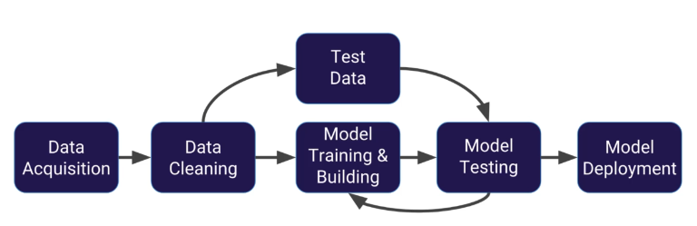
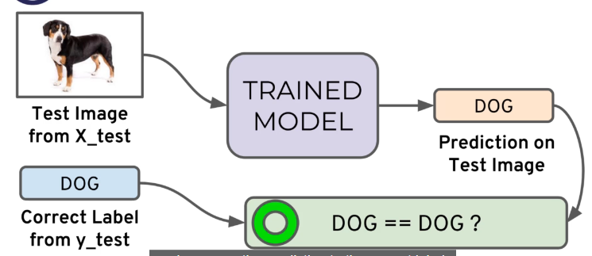
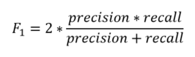
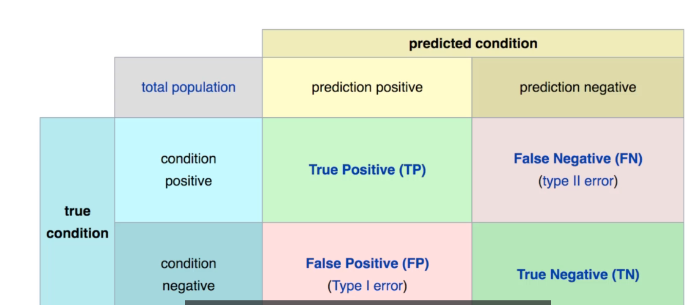
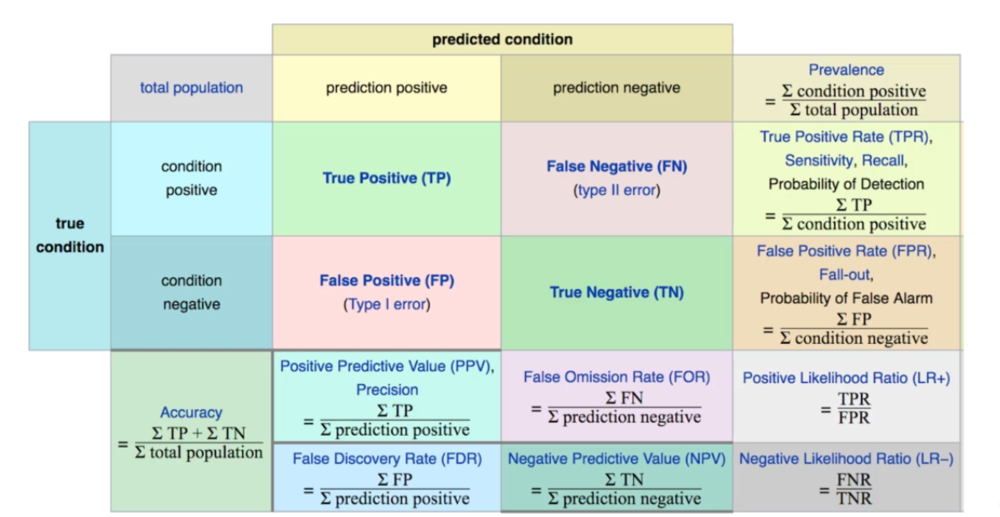
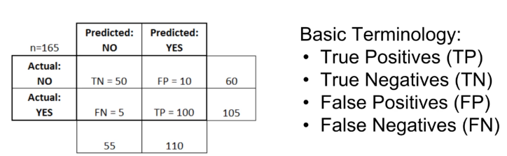
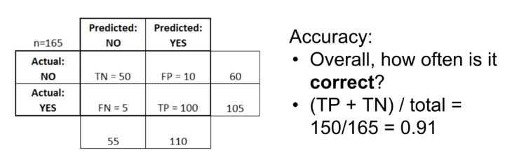
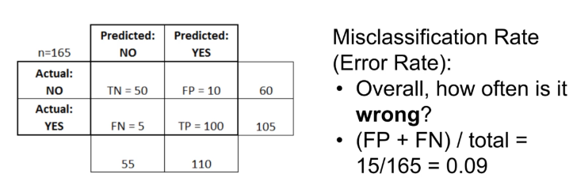

# Machine Learning Basics
____
Machine Learning is data analysis, finding insights from data using algorithms ireratively learn from data and building models.

Supervised Learning, algorithm is trained on labeled data where output are known for given input, such as image clissification of cat or dog. Used in applications where historical data predects new image or new data is.

First, Image Acquisition where uploading image or capturing image by self driving car for lane detection. After collecting raw data we need to go for Data Cleaning and formating where Keras provides lots of tools.The data can come in different sizes, format, or orientation and Keras helps to format the image.  Next step after cleaning data is to split data into test data and training data respectively 30% and 70% of cleaning data. The training data will be simply used for teaching model to predict or classify the image. Once model is trained we test using test data set, essentially trying to predict the data or image using test data to determine accuracy of the model. If it does not match tune the mdoel by adjusting paramteres in model by taking back to traning and building phase and fit the model again over and over again till we satisfied with the output. Last step is to deploy model to predict the new set of data. 

# Understanind Classification Metrices
---
The key classification metrics we need to understand are:                                       
Accuracy                                            
Recall                                                Precision                                 
F1-Score                                    

In classification task model can achieve only two results: Correct or Incorrect.

Suppose in case of binary classification where only two classes are defined we can predict wether its dog or cat. Once model is trained its test on test data without level, if it predicts correct as Dog its good model. If it predict Dog == Cat its incorrect, we sum up times when the model predicted correctly and incorrectly. Repeately performed testing and count correct prediction vs incorrect prediction and also keep in mind that correct or incorrect both does not hold equal values for that reasons we use different metrics methods.                                      

***Accuracy*** number of correct predictions by model divided by total number of predictions. For instance, X_test set has 100 images and model predicted 80 correctly then **80/100 = 0.8** 80% accuracy. Useful when target classes are well balanced, same amount of cat and dog images, not good choice with unbalance classes, not suitable for 100 dog images and 10 cat image; model will simply align to predict dog and get 95% accuracy. Due to this issue have to look for other metrics like precision and recall in order to understand how model is performing on unbalance class.                                        

***Recall*** = ***Number of True Positives***/***(Number of True Positives + Number of Flase Negative)***     
Its for determining all the relevent datasets

***Precision*** = ***Number of True Positives*** /***( Number of True Positives + Number of False Positives)***                             
Its determining specific data from numbers of relevent data set.

***F1-Score*** combining two metrices of recall and precision. The F1-score is the harmonic mean of precisoin and recall, taking both metrices into account.
                  
 Suppose precision is 1.0 however horrible recall score of 0.0 then would take simple average equal to 0.5, punish unbalance precision and recall. 

 ### Confusion Metrics 
 

 

 **True Negative** model predicted the patient has no cancer and in reality patients dont have cancer.                                        
 **False Positive** model predicted 10 patients has cancer but actually they dont have cance. 

 **False Negative** model predicted the 5 patients does not has cancer but they do have cance.

**True Positive** model predicted 110 patients has cancers and in reality they do have cancer.

 

 

 