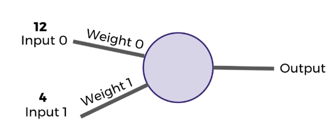
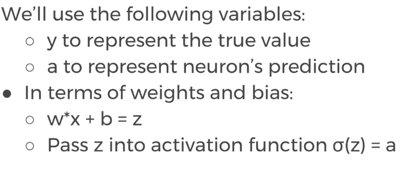
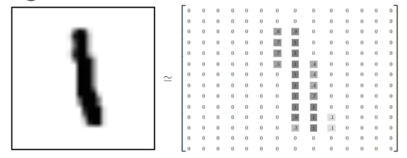

# Machine Learning Basics
____
Machine Learning is data analysis, finding insights from data using algorithms ireratively learn from data and building models.

Supervised Learning, algorithm is trained on labeled data where output are known for given input, such as image clissification of cat or dog. Used in applications where historical data predects new image or new data is.


First, Image Acquisition where uploading image or capturing image by self driving car for lane detection. After collecting raw data we need to go for Data Cleaning and formating where Keras provides lots of tools.The data can come in different sizes, format, or orientation and Keras helps to format the image.  Next step after cleaning data is to split data into test data and training data respectively 30% and 70% of cleaning data. The training data will be simply used for teaching model to predict or classify the image. Once model is trained we test using test data set, essentially trying to predict the data or image using test data to determine accuracy of the model. If it does not match tune the mdoel by adjusting paramteres in model by taking back to traning and building phase and fit the model again over and over again till we satisfied with the output. Last step is to deploy model to predict the new set of data. 

# Understanind Classification Metrices
---
The key classification metrics we need to understand are:                                       
Accuracy                                            
Recall                                                Precision                                 
F1-Score                                    

In classification task model can achieve only two results: Correct or Incorrect.


Suppose in case of binary classification where only two classes are defined we can predict wether its dog or cat. Once model is trained its test on test data without level, if it predicts correct as Dog its good model. If it predict Dog == Cat its incorrect, we sum up times when the model predicted correctly and incorrectly. Repeately performed testing and count correct prediction vs incorrect prediction and also keep in mind that correct or incorrect both does not hold equal values for that reasons we use different metrics methods.                                      

***Accuracy*** number of correct predictions by model divided by total number of predictions. For instance, X_test set has 100 images and model predicted 80 correctly then **80/100 = 0.8** 80% accuracy. Useful when target classes are well balanced, same amount of cat and dog images, not good choice with unbalance classes, not suitable for 100 dog images and 10 cat image; model will simply align to predict dog and get 95% accuracy. Due to this issue have to look for other metrics like precision and recall in order to understand how model is performing on unbalance class.                                        

***Recall*** = ***Number of True Positives***/***(Number of True Positives + Number of Flase Negative)***     
Its for determining all the relevent datasets

***Precision*** = ***Number of True Positives*** /***( Number of True Positives + Number of False Positives)***                             
Its determining specific data from numbers of relevent data set.

***F1-Score*** combining two metrices of recall and precision. The F1-score is the harmonic mean of precisoin and recall, taking both metrices into account.
                  
 Suppose precision is 1.0 however horrible recall score of 0.0 then would take simple average equal to 0.5, punish unbalance precision and recall. 

 ### Confusion Metrics 
 

 

 **True Negative** model predicted the patient has no cancer and in reality patients dont have cancer.                                        
 **False Positive** model predicted 10 patients has cancer but actually they dont have cance. 

 **False Negative** model predicted the 5 patients does not has cancer but they do have cance.

**True Positive** model predicted 110 patients has cancers and in reality they do have cancer.

 

 

 


 # Understanding Neuon

 Artificial Neural Networks (ANN) comes from biology, copying how biological neurons function. 
 

 Dendrites passed into body of the cell, can have many dendrites. The electrical pass through dendrites to the body of the cell, later on single output of single electrical signal comes out from Axon, later on connect to other neuron. 

 Artificial Neuron is called perceptron. Input have values of features such as number of room of a flat or how dark or bright is the image. The input are multiplied by weights, which are initilized through random generation. Say weight is selected randomly where weight0 = 0.5 and weight1 = -1. The product of input and weight passed through activation function.
In this we use simple activation function where if sum of input  +ve output 1 and if sum of input is -ve output 0
 
 

Suppose if we have 0 as input then what happens is product of input 0 wit any weight will be zero, which is fixed using bias term  in this case is 1. 
Mathematically we can represent in following manner. Number of inputs form i= 0 to n and Wi weight times input itself plus product. 


## Understanding Neural Network
Input layer is real data input, hidden layer is layers between input and output; more than 3 layers we called **DEEP NETWORK**. Final is output layer.


Simple activation Function discussed above, in this function small changes makes no difference. 

To solve the issue we use segmoid function whose value ranges between 0 and 1, where e^-(x) = e^-(z)

Output ranges from -1 to 1


## Cost Functions
Measure how well the given neurons are performing, use cost function to measure how far off from expected value.



Figure out how we can use our neurons and measurement of error and then attempt to correct our prediction, in other words learn.

## Gradient Descent and Back Propagation
Grdient descent is optimization algorithm to minimize cost function or error. Choose weight such that error is minimum.

Adjusting weights to match the requirement in this case back propogation comes into picture. Back propgation compute error contribution by each neuron after a batch of data processed, relies on chain rule go go back through network and compute errors. 

## Keras Basics
Keras library to create ML model with TensorFlow as a backend.
```Python
import numpy as np
from numpy import genfromtxt # generates an array from text file

# Specify the file path
data_path = r'P:\\Pi OpenCV  programming\\banknotedata.txt'

# Function to print a specific line number for debugging
def print_line(file_path, line_number):
    with open(file_path, 'r') as file:
        for current_line_number, line in enumerate(file, start=1):
            if current_line_number == line_number:
                print(f"Line {line_number}: {line.strip()}")
                break

# Print the problematic line
line_of_interest = 1373
print_line(data_path, line_of_interest)

# Attempt to read the file, skipping bad lines
try:
    data = np.genfromtxt(data_path, delimiter=',', invalid_raise=False)
    print("Data loaded successfully.")
    print(data[:5])
except Exception as e:
    print("An error occurred while loading data:", str(e))

data
```
Output:                                                 
The end value 0 and 1 indicates classes, 0 means unauthonticated and 1 means real
```
 Line 1373: Ask
Data loaded successfully.
[[ 3.6216   8.6661  -2.8073  -0.44699  0.     ]
 [ 4.5459   8.1674  -2.4586  -1.4621   0.     ]
 [ 3.866   -2.6383   1.9242   0.10645  0.     ]
 [ 3.4566   9.5228  -4.0112  -3.5944   0.     ]
 [ 0.32924 -4.4552   4.5718  -0.9888   0.     ]]
C:\Users\USER\AppData\Local\Temp\ipykernel_11576\2219944788.py:18: ConversionWarning: Some errors were detected !
    Line #1373 (got 1 columns instead of 5)
  data = np.genfromtxt(data_path, delimiter=',', invalid_raise=False)                           
```
```Python
# Split the data into class and labels
# saperating labels 
labels = data[:, 4]
labels
```
Output:                                         
```Python
array([0., 0., 0., ..., 1., 1., 1.])
```
```Python
# Split the data into features and labels
# saperating labels 
features = data[:, 0:4]
features
```
Output:                                         
```Python
array([[  3.6216 ,   8.6661 ,  -2.8073 ,  -0.44699],
       [  4.5459 ,   8.1674 ,  -2.4586 ,  -1.4621 ],
       [  3.866  ,  -2.6383 ,   1.9242 ,   0.10645],
       ...,
       [ -3.7503 , -13.4586 ,  17.5932 ,  -2.7771 ],
       [ -3.5637 ,  -8.3827 ,  12.393  ,  -1.2823 ],
       [ -2.5419 ,  -0.65804,   2.6842 ,   1.1952 ]])
```
This parameter specifies that 33% of the dataset should be randomly allocated to the test set, while the remaining 67% will be used for training the model. 
```Python
# Split the data into training and test sets
# saperating data for traing and testing, X and y are methamatical notation used in ML
X = features
y = labels

# spliting data in training and test data set, split X and y data into training and test set randomly
from sklearn.model_selection import train_test_split

# split features and labels into training and test set into 33% and 42 is standard value
X_train, X_test, y_train, y_test = train_test_split(X, y, test_size=0.33, random_state=42)

X_train

len(X_train)

# Before spliting the data
len(X)

# length of test data
len(X_test)

```
Output:                                         
```Python
    array([[-0.8734  , -0.033118, -0.20165 ,  0.55774 ],
       [ 2.0177  ,  1.7982  , -2.9581  ,  0.2099  ],
       [-0.36038 ,  4.1158  ,  3.1143  , -0.37199 ],
       ...,
       [-7.0364  ,  9.2931  ,  0.16594 , -4.5396  ],
       [-3.4605  ,  2.6901  ,  0.16165 , -1.0224  ],
       [-3.3582  , -7.2404  , 11.4419  , -0.57113 ]])

       919

       1372

       453
```
```Python
X_test

y_train

y_test

X_test.max()

x_test.min()
```
Output:                                         
```Python
    array([[ 1.5691  ,  6.3465  , -0.1828  , -2.4099  ],
       [-0.27802 ,  8.1881  , -3.1338  , -2.5276  ],
       [ 0.051979,  7.0521  , -2.0541  , -3.1508  ],
       ...,
       [ 3.5127  ,  2.9073  ,  1.0579  ,  0.40774 ],
       [ 5.504   , 10.3671  , -4.413   , -4.0211  ],
       [-0.2062  ,  9.2207  , -3.7044  , -6.8103  ]])


       y_train and y_test are bunches of 0s and 1s
       
 17.1116

-13.2869
```   
```python
scaled_X_train = scaler_object.transform(X_train)

scaled_X_test = scaler_object.transform(X_test)

scaled_X_train.max()
```
Output:                                         
```Python
    1.0000000000000002

```

```Python
from tensorflow.keras.models import Sequential
from tensorflow.keras.layers import Dense


model = Sequential()

model.add(Dense(4, input_dim=4, activation='relu'))

model.add(Dense(8, activation='relu'))

model.add(Dense(1, activation='sigmoid'))


model.compile(loss='binary_crossentropy', optimizer='adam', metrics=['accuracy'])

model.fit(scaled_X_train, y_train, epochs=50,verbose = 2, batch_size=10)

from sklearn.metrics import classification_report, confusion_matrix

# Assuming your model has been defined, compiled, and trained already:
# model = ...

# Use the predict method to get the output probabilities
predictions = model.predict(scaled_X_test)

# Convert probabilities to class labels (0 or 1)
predicted_classes = (predictions > 0.5).astype(int)

# Now, you can use predicted_classes to evaluate the model
from sklearn.metrics import classification_report, confusion_matrix

# Assuming y_test contains the true class labels
print(confusion_matrix(y_test, predicted_classes))

print(classification_report(y_test, predicted_classes))

model.save('myModel.h5')

from keras.models import load_model

newmodel = load_model('myModel.h5')

newmodel.predict(scaled_X_test)
```
Output:                                         
```Python
    Epoch 1/50
92/92 - 1s - 15ms/step - accuracy: 0.5571 - loss: 0.6740
Epoch 2/50
92/92 - 0s - 1ms/step - accuracy: 0.5865 - loss: 0.6335
Epoch 3/50
92/92 - 0s - 1ms/step - accuracy: 0.6746 - loss: 0.5950
Epoch 4/50
92/92 - 0s - 1ms/step - accuracy: 0.7737 - loss: 0.5563
Epoch 5/50
92/92 - 0s - 1ms/step - accuracy: 0.8074 - loss: 0.5189
Epoch 6/50
92/92 - 0s - 1ms/step - accuracy: 0.8292 - loss: 0.4827
Epoch 7/50
92/92 - 0s - 1ms/step - accuracy: 0.8618 - loss: 0.4462
Epoch 8/50
92/92 - 0s - 1ms/step - accuracy: 0.8879 - loss: 0.4128
Epoch 9/50
92/92 - 0s - 2ms/step - accuracy: 0.9010 - loss: 0.3833
Epoch 10/50
92/92 - 0s - 1ms/step - accuracy: 0.9042 - loss: 0.3583
Epoch 11/50
92/92 - 0s - 1ms/step - accuracy: 0.9064 - loss: 0.3349
Epoch 12/50
92/92 - 0s - 1ms/step - accuracy: 0.9086 - loss: 0.3161
Epoch 13/50
...
Epoch 49/50
92/92 - 0s - 1ms/step - accuracy: 0.9663 - loss: 0.0849
Epoch 50/50
92/92 - 0s - 1ms/step - accuracy: 0.9684 - loss: 0.0823
Output is truncated. View as a scrollable element or open in a text editor. Ad
```
Output:                                         
```Python
Line 1373: Ask
Data loaded successfully.
[[ 3.6216   8.6661  -2.8073  -0.44699  0.     ]
 [ 4.5459   8.1674  -2.4586  -1.4621   0.     ]
 [ 3.866   -2.6383   1.9242   0.10645  0.     ]
 [ 3.4566   9.5228  -4.0112  -3.5944   0.     ]
 [ 0.32924 -4.4552   4.5718  -0.9888   0.     ]]
C:\Users\USER\AppData\Local\Temp\ipykernel_11576\2219944788.py:18: ConversionWarning: Some errors were detected !
    Line #1373 (got 1 columns instead of 5)
  data = np.genfromtxt(data_path, delimiter=',', invalid_raise=False)
array([[  3.6216 ,   8.6661 ,  -2.8073 ,  -0.44699,   0.     ],
       [  4.5459 ,   8.1674 ,  -2.4586 ,  -1.4621 ,   0.     ],
       [  3.866  ,  -2.6383 ,   1.9242 ,   0.10645,   0.     ],
       ...,
       [ -3.7503 , -13.4586 ,  17.5932 ,  -2.7771 ,   1.     ],
       [ -3.5637 ,  -8.3827 ,  12.393  ,  -1.2823 ,   1.     ],
       [ -2.5419 ,  -0.65804,   2.6842 ,   1.1952 ,   1.     ]])
array([0., 0., 0., ..., 1., 1., 1.])
array([[  3.6216 ,   8.6661 ,  -2.8073 ,  -0.44699],
       [  4.5459 ,   8.1674 ,  -2.4586 ,  -1.4621 ],
       [  3.866  ,  -2.6383 ,   1.9242 ,   0.10645],
       ...,
       [ -3.7503 , -13.4586 ,  17.5932 ,  -2.7771 ],
       [ -3.5637 ,  -8.3827 ,  12.393  ,  -1.2823 ],
       [ -2.5419 ,  -0.65804,   2.6842 ,   1.1952 ]])
array([[-0.8734  , -0.033118, -0.20165 ,  0.55774 ],
       [ 2.0177  ,  1.7982  , -2.9581  ,  0.2099  ],
       [-0.36038 ,  4.1158  ,  3.1143  , -0.37199 ],
       ...,
       [-7.0364  ,  9.2931  ,  0.16594 , -4.5396  ],
       [-3.4605  ,  2.6901  ,  0.16165 , -1.0224  ],
       [-3.3582  , -7.2404  , 11.4419  , -0.57113 ]])
  Cell In[32], line 1
    pip install scikit-learn
        ^
SyntaxError: invalid syntax
Collecting scikit-learn
  Downloading scikit_learn-1.4.2-cp311-cp311-win_amd64.whl.metadata (11 kB)
Requirement already satisfied: numpy>=1.19.5 in c:\python311\lib\site-packages (from scikit-learn) (1.26.2)
Collecting scipy>=1.6.0 (from scikit-learn)
  Downloading scipy-1.13.0-cp311-cp311-win_amd64.whl.metadata (60 kB)
     ---------------------------------------- 0.0/60.6 kB ? eta -:--:--
     ------------ ------------------------- 20.5/60.6 kB 330.3 kB/s eta 0:00:01
     ------------------- ------------------ 30.7/60.6 kB 435.7 kB/s eta 0:00:01
     -------------------------------- ----- 51.2/60.6 kB 327.7 kB/s eta 0:00:01
     -------------------------------------- 60.6/60.6 kB 359.6 kB/s eta 0:00:00
Collecting joblib>=1.2.0 (from scikit-learn)
  Downloading joblib-1.4.0-py3-none-any.whl.metadata (5.4 kB)
Collecting threadpoolctl>=2.0.0 (from scikit-learn)
  Downloading threadpoolctl-3.4.0-py3-none-any.whl.metadata (13 kB)
Downloading scikit_learn-1.4.2-cp311-cp311-win_amd64.whl (10.6 MB)
   ---------------------------------------- 0.0/10.6 MB ? eta -:--:--
   ---------------------------------------- 0.0/10.6 MB 960.0 kB/s eta 0:00:12
   ---------------------------------------- 0.1/10.6 MB 812.7 kB/s eta 0:00:13
   ---------------------------------------- 0.1/10.6 MB 812.7 kB/s eta 0:00:13
   ---------------------------------------- 0.1/10.6 MB 812.7 kB/s eta 0:00:13
   ---------------------------------------- 0.1/10.6 MB 812.7 kB/s eta 0:00:13
   ---------------------------------------- 0.1/10.6 MB 231.0 kB/s eta 0:00:46
   ---------------------------------------- 0.1/10.6 MB 359.9 kB/s eta 0:00:30
    --------------------------------------- 0.1/10.6 MB 387.0 kB/s eta 0:00:28
    --------------------------------------- 0.2/10.6 MB 366.6 kB/s eta 0:00:29
...
   ---------------------------------------- 46.2/46.2 MB 215.7 kB/s eta 0:00:00
Using cached threadpoolctl-3.4.0-py3-none-any.whl (17 kB)
Installing collected packages: threadpoolctl, scipy, joblib, scikit-learn
Successfully installed joblib-1.4.0 scikit-learn-1.4.2 scipy-1.13.0 threadpoolctl-3.4.0
Output is truncated. View as a scrollable element or open in a text editor. Adjust cell output settings...
919
1372
453
array([[ 1.5691  ,  6.3465  , -0.1828  , -2.4099  ],
       [-0.27802 ,  8.1881  , -3.1338  , -2.5276  ],
       [ 0.051979,  7.0521  , -2.0541  , -3.1508  ],
       ...,
       [ 3.5127  ,  2.9073  ,  1.0579  ,  0.40774 ],
       [ 5.504   , 10.3671  , -4.413   , -4.0211  ],
       [-0.2062  ,  9.2207  , -3.7044  , -6.8103  ]])
array([1., 1., 0., 1., 0., 0., 1., 0., 0., 1., 0., 0., 0., 1., 1., 1., 0.,
       1., 1., 1., 0., 1., 1., 1., 0., 1., 0., 0., 1., 0., 0., 0., 1., 0.,
       1., 0., 0., 0., 0., 1., 1., 0., 0., 1., 0., 0., 1., 1., 1., 0., 0.,
       0., 1., 1., 1., 1., 1., 1., 1., 0., 0., 0., 0., 0., 0., 1., 0., 1.,
       0., 0., 0., 0., 1., 1., 0., 1., 1., 0., 1., 0., 1., 1., 1., 1., 1.,
       1., 1., 1., 1., 1., 1., 0., 1., 0., 0., 0., 0., 1., 1., 1., 0., 0.,
       0., 1., 0., 1., 1., 1., 1., 0., 0., 0., 0., 0., 0., 0., 0., 0., 0.,
       0., 0., 0., 1., 1., 0., 1., 0., 1., 0., 0., 0., 0., 0., 1., 1., 0.,
       0., 0., 0., 0., 0., 0., 0., 0., 0., 0., 1., 1., 0., 1., 0., 0., 1.,
       1., 0., 1., 0., 0., 1., 0., 1., 1., 0., 0., 0., 0., 0., 0., 1., 0.,
       0., 0., 1., 1., 0., 1., 1., 1., 1., 1., 0., 1., 1., 0., 0., 1., 1.,
       0., 1., 1., 0., 1., 1., 0., 0., 0., 0., 1., 0., 0., 1., 0., 1., 0.,
       0., 1., 0., 0., 1., 1., 0., 0., 1., 1., 0., 1., 1., 1., 0., 0., 0.,
       1., 0., 0., 1., 0., 0., 0., 1., 0., 0., 1., 0., 1., 0., 0., 0., 0.,
       0., 1., 1., 0., 0., 1., 0., 0., 1., 0., 0., 1., 0., 1., 1., 1., 0.,
       1., 0., 0., 0., 1., 0., 0., 1., 1., 1., 0., 1., 0., 1., 1., 0., 0.,
       1., 1., 1., 1., 0., 0., 1., 0., 1., 0., 1., 0., 0., 0., 1., 0., 1.,
       1., 0., 0., 1., 0., 1., 0., 1., 0., 1., 0., 0., 0., 0., 1., 0., 1.,
       1., 1., 1., 1., 1., 0., 0., 0., 1., 0., 0., 0., 1., 0., 1., 0., 0.,
       0., 0., 0., 1., 0., 1., 1., 0., 1., 0., 0., 1., 0., 0., 0., 0., 0.,
       0., 1., 1., 1., 0., 1., 0., 0., 0., 1., 1., 0., 0., 1., 0., 1., 0.,
       0., 0., 0., 0., 0., 1., 1., 1., 0., 0., 0., 0., 0., 0., 1., 1., 1.,
       0., 0., 0., 1., 1., 1., 1., 0., 0., 1., 0., 0., 0., 1., 0., 0., 1.,
       0., 0., 0., 1., 0., 0., 1., 1., 0., 1., 0., 0., 0., 1., 1., 0., 1.,
       0., 0., 1., 0., 0., 1., 0., 1., 1., 0., 1., 0., 0., 0., 0., 1., 0.,
...
       0., 0., 0., 1., 0., 1., 1., 1., 0., 0., 1., 0., 1., 0., 1., 0., 1.,
       0., 0., 0., 0., 0., 1., 0., 1., 0., 0., 1., 1., 1., 0., 1., 0., 1.,
       0., 1., 0., 0., 1., 0., 1., 0., 0., 0., 1., 0., 1., 0., 1., 1., 0.,
       1., 0., 1., 1., 0., 1., 1., 0., 0., 1., 0., 0., 1., 1., 1., 1., 1.,
       1.])
Output is truncated. View as a scrollable element or open in a text editor. Adjust cell output settings...
17.1116
-13.2869

  MinMaxScaler?i
MinMaxScaler()
1.0000000000000002
Epoch 1/50
92/92 - 1s - 15ms/step - accuracy: 0.5571 - loss: 0.6740
Epoch 2/50
92/92 - 0s - 1ms/step - accuracy: 0.5865 - loss: 0.6335
Epoch 3/50
92/92 - 0s - 1ms/step - accuracy: 0.6746 - loss: 0.5950
Epoch 4/50
92/92 - 0s - 1ms/step - accuracy: 0.7737 - loss: 0.5563
Epoch 5/50
92/92 - 0s - 1ms/step - accuracy: 0.8074 - loss: 0.5189
Epoch 6/50
92/92 - 0s - 1ms/step - accuracy: 0.8292 - loss: 0.4827
Epoch 7/50
92/92 - 0s - 1ms/step - accuracy: 0.8618 - loss: 0.4462
Epoch 8/50
92/92 - 0s - 1ms/step - accuracy: 0.8879 - loss: 0.4128
Epoch 9/50
92/92 - 0s - 2ms/step - accuracy: 0.9010 - loss: 0.3833
Epoch 10/50
92/92 - 0s - 1ms/step - accuracy: 0.9042 - loss: 0.3583
Epoch 11/50
92/92 - 0s - 1ms/step - accuracy: 0.9064 - loss: 0.3349
Epoch 12/50
92/92 - 0s - 1ms/step - accuracy: 0.9086 - loss: 0.3161
Epoch 13/50
...
Epoch 49/50
92/92 - 0s - 1ms/step - accuracy: 0.9663 - loss: 0.0849
Epoch 50/50
92/92 - 0s - 1ms/step - accuracy: 0.9684 - loss: 0.0823
Output is truncated. View as a scrollable element or open in a text editor. Adjust cell output settings...
<keras.src.callbacks.history.History at 0x21e505176d0>
---------------------------------------------------------------------------
AttributeError                            Traceback (most recent call last)
Cell In[52], line 1
----> 1 model.metrices_names

AttributeError: 'Sequential' object has no attribute 'metrices_names'
15/15 ━━━━━━━━━━━━━━━━━━━━ 0s 970us/step
[[256   1]
 [  9 187]]
```
```Python
  precision    recall  f1-score   support

         0.0       0.97      1.00      0.98       257
         1.0       0.99      0.95      0.97       196

    accuracy                           0.98       453
   macro avg       0.98      0.98      0.98       453
weighted avg       0.98      0.98      0.98       453
```

```Python
  rray([[7.16385059e-03],
       [4.43211943e-01],
       [1.82099521e-01],
       [2.94954749e-03],
       [7.13318167e-03],
       [2.56554619e-03],
       [3.87931094e-02],
       [8.25526833e-04],
       [5.30271744e-03],
       [1.60762873e-02],
       [7.31683135e-01],
       [9.80250239e-01],
       [1.94021892e-02],
       [9.13487494e-01],
       [2.27068126e-01],
       [3.99036527e-01],
       [9.78963673e-01],
       [9.82763529e-01],
       [8.67342830e-01],
       [9.16826665e-01],
       [2.65382067e-03],
       [8.09666235e-03],
       [9.43395019e-01],
       [1.53510447e-03],
       [9.95135903e-01],
...
       [1.00568021e-02],
       [4.30047605e-03],
       [2.38898024e-03],

  ```

## MNIST Data Overviews
Has 60,000 training data set, 10,000 test data set.
It has handwritten digits from 0 to 9 of 28 by 28 pixel size.



## Convolution Neural Networs Overview - Part One


For dansly connected layer where every input node is connected to every other nodes


WHy do we need convolution neural network when DNN is fulfilling the need is because some data are 28x28 pixels, total of 784 but some images are more that 256X256, totaling more than 56k, leading to too many parameters, unscalable to new images.


It often seen that when the window is at the courners are out of corners, for fixing the issue we use technique cqlled padding by adding zeros around the image pixel


## Convolution Neural Networs Overview - Part Two
Subsampling or pooling
In this method where kernel of prescribed size is placed on the original image pixel and max value from the kernel is taken to next layer. Another common technique used in CNN is called dropout to help overfitting. During traing, randomly dropped.

