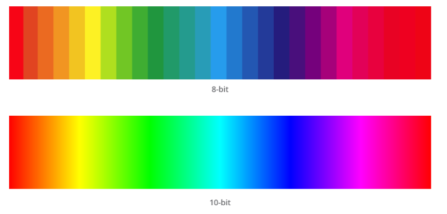
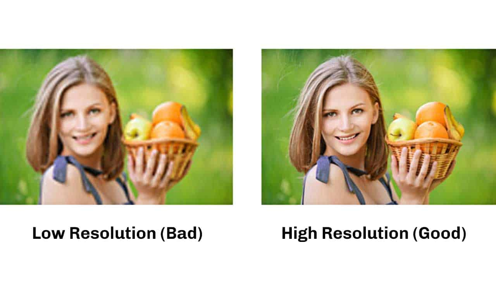
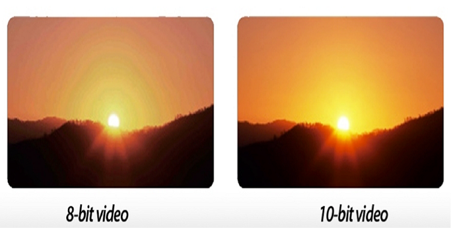

# int8, int16, int32, int64
---

This is array of image 

```Python
array([[[185, 195, 205],
        [186, 196, 206],
        [186, 196, 206],
        ...,
        [204, 214, 224],
        [204, 214, 224],
        [204, 214, 224]],

       [[185, 195, 205],
        [186, 196, 206],
        [186, 196, 206],
        ...,
        [204, 214, 224],
        [204, 214, 224],
        [204, 214, 224]],

       [[185, 195, 205],
        [186, 196, 206],
        [186, 196, 206],
        ...,
        [204, 214, 224],
        [204, 214, 224],
        [204, 214, 224]],

       ...,

       [[182, 192, 202],
        [182, 192, 202],
        [182, 192, 202],
        ...,
        [193, 203, 213],
        [193, 203, 213],
        [193, 203, 213]],

       [[183, 193, 203],
        [182, 192, 202],
        [182, 192, 202],
        ...,
        [193, 203, 213],
        [193, 203, 213],
        [193, 203, 213]],

       [[183, 193, 203],
        [183, 193, 203],
        [182, 192, 202],
        ...,
        [193, 203, 213],
        [193, 203, 213],
        [193, 203, 213]]], dtype=uint8)

        ```
        Suppose I take out certain pixel of the image 

     185, 195, 205],
        [186, 196, 206],
        [186, 196, 206]


        This is how it will be stored in memory 

        Pixel 1:
Red:   0000000010111001
Green: 0000000011000011
Blue:  0000000011001101

Pixel 2:
Red:   0000000010111010
Green: 0000000011000100
Blue:  0000000011001110

Pixel 3:
Red:   0000000010111010
Green: 0000000011000100
Blue:  0000000011001110


Pixel 1: [185, 195, 205]

Red: 10111001
Green: 11000011
Blue: 11001101
Pixel 2: [186, 196, 206]

Red: 10111010
Green: 11000100
Blue: 11001110
Pixel 3: [186, 196, 206]

Red: 10111010
Green: 11000100
Blue: 11001110

Red component: 2 bytes
Green component: 2 bytes
Blue component: 2 bytes

        ```

        Each pixel R will occupy 2 bytes, G occupy 2 bytes, and B occupy 2 bytes total 6bytes by each pixel 

If you have an image with dimensions 512 pixels wide by 512 pixels tall and 3 color channels (RGB), the total number of pixels in the image can be calculated by multiplying the width, height, and number of channels together.

So, the total number of pixels would be:

Total pixels = Width × Height × Channels

Substituting the given values:

Total pixels = 512 pixels × 512 pixels × 3 channels

Total pixels = 786,432 pixels

Therefore, there will be 786,432 pixels in the image.

Given that there are 786,432 pixels in the image (as calculated previously), and each pixel occupies 6 bytes:

Total memory consumption = Total pixels × Bytes per pixel

Substituting the values:

Total memory consumption = 786,432 pixels × 6 bytes/pixel

Total memory consumption = 4,718,592 bytes

So, if you use np.int16 for each color channel in a 512x512 image with 3 channels, the total memory consumption will be approximately 4,718,592 bytes, which is equivalent to approximately 4.5 megabytes (since 1 megabyte is 1,048,576 bytes).


In the image processing if we use 8bit color depth where value of both grayscalea and colored image will be between 0 to 255, like HD (High Defination) or SD (Standard Defination) videos where details are not much. If we want more details of image or video it we should use 10-bits depth which will have 0 t0 1023 for both colored and grayscale image like image of 4K Ultra HD or High Dynamic Range (HDR) where video or image quality will be high. Suppoase if 8bit means color 0 will be represented as 00000000 and if we talk about 10 bit color depth we represent 1023 as 1111111111. 

```




ommon bit depths include 8-bit (256 colors), 10-bit (1024 colors), and 12-bit (4096 colors)                    
Common resolutions include standard-definition (SD), high-definition (HD), Full HD, and 4K, which have specific pixel dimensions such as 720p (1280x720 pixels), 1080p (1920x1080 pixels), and 4K (3840x2160 pixels). 10 bit color depth will give more variation of color combinations for more details and higher resolution will give more number of pixel such that lowe resolution image will be blurry compared to high resolution image. 

